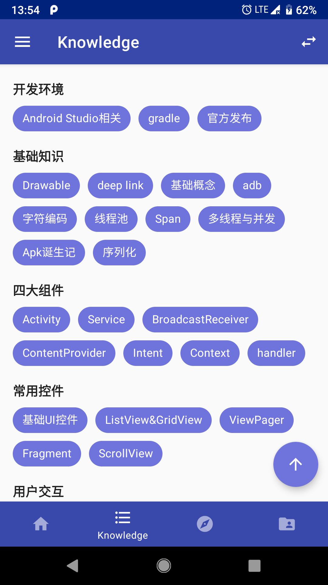
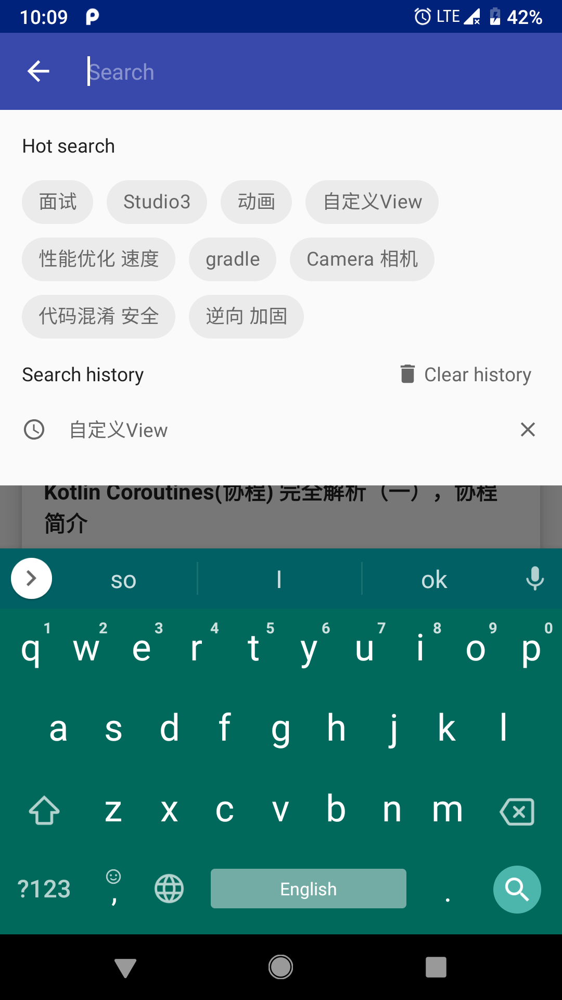
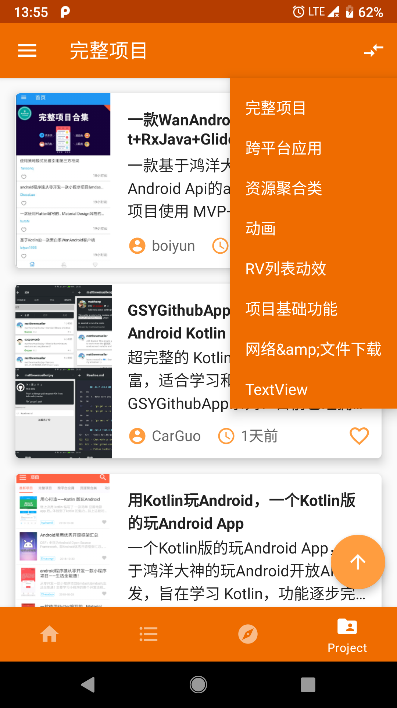
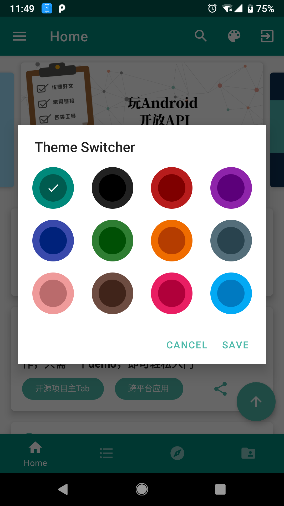
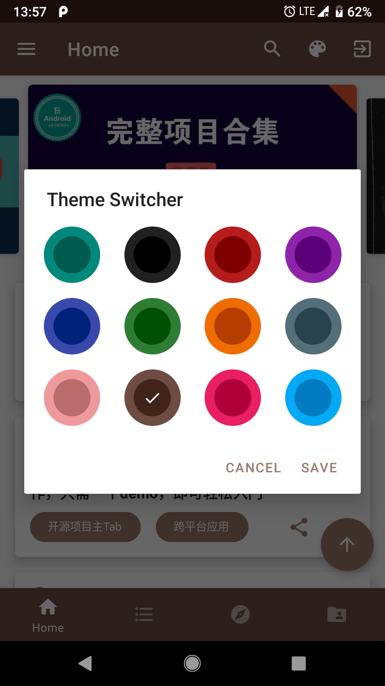

## 概述
本项目是基于数据使用的是鸿洋大神的[玩Android开放API](http://wanandroid.com/blog/show/2)，采用的是Kotlin+MVP+Dagger2+Rxjava架构，由于个人非常喜欢Google的Material Design设计风格，所以该项目界面风格基本上也都遵循Google Material Design规范。  
由于该项目也是自己业余时间用来学习Kotlin和一些新的Android开放框架来写着玩的，可能在架构封装等方面还不是很完善，如果大家有好的意见或者建议，欢迎提[issues](https://github.com/songmao123/WanAndroid/issues)或[Pull requests](https://github.com/songmao123/WanAndroid/pulls)。 

## 界面预览：
1. Gif预览: 
 

2. 图片预览： 
     
     
     
